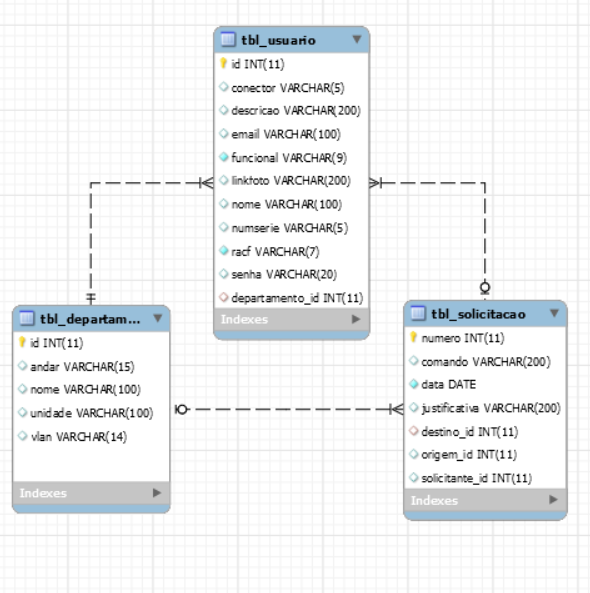

<h1 align="center">VlanManager Backend 👋</h1>

  
  
  

> API com a lista de usuários e departamentos

### ✨ [Demo](https://vlan-manager.netlify.app)

## Author

👤 **Leandro Matos**

* Aplicação Web: https://vlan-manager.netlify.app/
* Swagger: https://api-vlan-manager.herokuapp.com/swagger-ui.html
* Rota - Usuários: https://api-vlan-manager.herokuapp.com/usuarios
* Rota - Departamentos: https://api-vlan-manager.herokuapp.com/departamentos
* Github: [@leandro-matos](https://github.com/leandro-matos)
* Website: https://www.gitshowcase.com/leandro-matos

## 🚀  Tecnologias
Backend:
-	[SpringBoot](https://spring.io/projects/spring-boot)
-	[MySql](https://www.mysql.com)
-	[Swagger](https://swagger.io)

### MySQL:

## Show your support

Give a ⭐️ if this project helped you!
